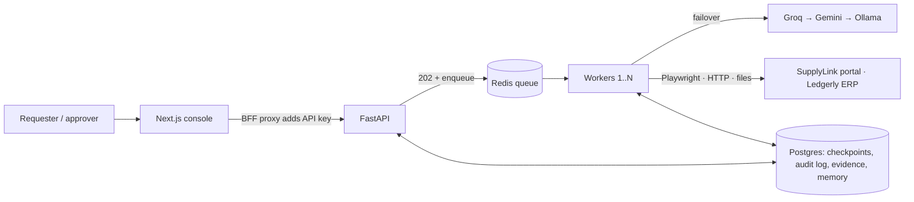

# Autonomous Company Operator

An AI operator that turns a short company request into **completed, verified work**. Give it
*"Find the latest invoice from Acme Corp, extract the amount and due date, enter it into our
internal system, and tell me once it is done"* and it works out what that means at this company,
plans, signs into the supplier portal, downloads and reads the invoice PDF, checks the ERP for a
duplicate, asks a manager to approve the high-value entry, fills the ERP form, recovers from
errors along the way, and then **independently verifies** the record exists before reporting
back with evidence.

Everything company-specific — systems, procedures, approval policies — lives in
[`company_context/`](company_context). The same agent code runs every task.

**Demo video:** _link added after recording_

---

## Quick start

Prerequisites: Docker (or, on Windows without Docker, see *Native Windows* below), plus an API
key for at least one free LLM backend (Groq or Gemini), or a local Ollama.

```bash
cp .env.example .env          # fill every change-me value and at least one LLM key
make up                       # postgres, redis, migrations, api, 2 workers, sandbox, console
open http://localhost:3000    # operator console
```

Run the evaluation scenarios against the running stack:

```bash
uv run python scripts/evaluate.py            # all scenarios
uv run python scripts/evaluate.py --only invoice_entry
```

Turn on failure injection in `.env` (`CHAOS__ENABLED=true`, `CHAOS__SEED=42`) and restart the
sandbox to watch recovery.

<details>
<summary>Native Windows (no Docker)</summary>

```powershell
uv sync --python 3.12; uv run poe browsers
./scripts/windows/infra.ps1 init      # portable Postgres 16 + Redis, creates role/databases
uv run poe migrate; uv run poe seed
# separate terminals:
uv run poe sandbox-portal; uv run poe sandbox-erp; uv run poe api; uv run poe worker
cd frontend; npm ci; npm run dev
```
</details>

Quality gates: `make lint typecheck test` (ruff, mypy strict, pytest; eslint, prettier, tsc).
Integration tests: `make test-integration` (needs Postgres and Redis).

---

## Architecture



**The loop:** `Goal → Understand → Plan → Execute ⇄ Observe → (Re-plan) → Verify → Complete`,
with `ask human` / `await approval` pauses that resume from a durable checkpoint.

| Stage | What happens |
|---|---|
| Understand | Retrieves relevant procedures and past lessons; produces a structured goal (outcome, entities, assumptions). Asks only if a blocking ambiguity remains. |
| Plan | Steps plus **machine-checkable success criteria** (e.g. "ERP read API returns exactly one invoice for Acme Corp with `{{facts.amount}}`"). |
| Execute | One action at a time through a tool registry: browser (Playwright), files (PDF/DOCX/CSV), HTTP. Every action is assessed (risk, system, exact payload) and checked against policy first. |
| Observe | Settled page snapshot with element refs, document text or API response. Failure streaks and loops trigger re-planning. |
| Verify | Re-reads the system of record and checks every criterion in code. One repair attempt, then fail with evidence. |
| Complete | Summary, key results, evidence (screenshots, files, verification JSON), lessons written to company memory. |

Full component breakdown, state diagram and data model: [`docs/architecture.md`](docs/architecture.md).

---

## Key design decisions

| Decision | Why | ADR |
|---|---|---|
| Custom state-machine runtime, no agent framework | Durable pauses, payload-bound approvals and independent verification are first-class; every line explainable | [0001](docs/adr/0001-custom-runtime.md) |
| DOM/accessibility snapshots, screenshots only as evidence | Precise and cheap with free models; form metadata lets policy see what a submit will send | [0002](docs/adr/0002-dom-snapshots-over-vision.md) |
| Independent verifier, also used as a pre-write idempotency guard | "Saved" isn't proof; prevents duplicates after retries and lost acknowledgements | [0003](docs/adr/0003-independent-verifier.md) |
| Policy-driven approvals bound to the exact payload | Humans approve data, not intentions; approvals survive restarts | [0004](docs/adr/0004-policy-driven-approvals.md) |
| Queue + workers + checkpoints | Minutes-long runs, hours-long pauses, crash/deploy safety, horizontal scale | [0005](docs/adr/0005-queue-based-execution.md) |
| Free LLMs behind a failover router, app-enforced structured output | Free tiers rate-limit; consistent behaviour across providers | [0006](docs/adr/0006-free-llm-failover.md) |
| Realistic sandbox company with seeded chaos | Recovery paths are exercised, not assumed | [0007](docs/adr/0007-sandbox-with-chaos.md) |

---

## How generalization works

| Never changes per task | Changes per task / company |
|---|---|
| Runtime, stages, prompts, tools, policy engine, verifier | The natural-language request |
| API, workers, storage | `company_context/procedures/*.md` (how this company does the work) |
| | `company_context/policies.yaml` (what needs approval / is forbidden) |
| | `company_context/profile.yaml` (systems, URLs, credential references) |

[`evals/scenarios.yaml`](evals/scenarios.yaml) runs five different requests through the same
code: invoice entry (with approval), vendor onboarding (with approval), overdue CSV report,
an ambiguous vendor name (the operator asks), and a forbidden request (mark invoices paid).

---

## Reliability

| Failure | Detection | Response |
|---|---|---|
| 5xx, timeout, slow page | HTTP status / timeout on read actions | Retry with exponential backoff + full jitter |
| Late-rendering page | Element count still changing | Snapshot waits until the page settles |
| Session expired | Login page in the observation | Agent signs in again (credentials by reference) and continues |
| Validation error | Error message in the snapshot | Agent fixes the field as instructed; lesson saved to memory |
| Changed labels / layout | Refs are re-derived every observation | Agent chooses elements by meaning |
| Lost acknowledgement (write committed, client got 502) | — | Pre-write verifier finds the record; write skipped, no duplicate |
| Repeated failure / loop | Observer streak and repetition checks | Re-plan (capped) |
| LLM rate limit / outage | 429, errors, open circuit | Fail over to the next backend; defer the job if all are down |
| Worker crash / deploy | Job retried by arq | Resume from last checkpoint under a run lock |
| Prompt injection in a document | — | Content is delimited as untrusted data; only the goal and policy drive actions |
| Runaway run | Step / re-plan / token / time budgets | Graceful stop with summary and evidence |

Chaos in the sandbox (`sandbox/sandbox/chaos.py`, seeded): random 503s, slow responses,
delayed forms, session expiry, alternative button labels, acknowledgement-loss trap.

---

## Models, APIs, frameworks and services

- **LLMs (free tiers):** Groq `openai/gpt-oss-120b`, Google Gemini `gemini-2.5-flash`, local Ollama
  `qwen3.5:9b`. All via their OpenAI-compatible endpoints; models are configuration.
- **Backend:** Python 3.12, FastAPI, Pydantic v2, SQLAlchemy 2 (async) + Alembic, asyncpg,
  redis-py, arq, httpx, truststore, sse-starlette.
- **Computer use:** Playwright (Chromium). **Documents:** pypdf, python-docx.
- **Infrastructure:** PostgreSQL 16, Redis 7, Docker Compose.
- **Frontend:** Next.js 16 (App Router), React 19, TypeScript (strict), Tailwind CSS 4.
- **Sandbox:** FastAPI + Jinja2, SQLite, fpdf2.
- **Quality:** ruff, mypy (strict), pytest, ESLint, Prettier, GitHub Actions.

---

## Assumptions

- The operator acts as an AP clerk for one company; one company context per deployment.
- Systems of record expose a readable source of truth (a read API or exportable view) that
  verification can use; data entry happens through the UI like a human would.
- Company procedures are written down (here as markdown SOPs) and kept current.
- Approvers use the console; approval and clarification can take arbitrarily long.
- All systems are the local sandbox; no real company credentials or data are used.

## Known limitations

- Web apps only: no native desktop automation or vision fallback yet.
- Free-tier LLMs make full runs slow (tens of sequential calls under rate limits) and
  occasionally imprecise; smaller local models are noticeably weaker.
- Browser sessions are not persisted across pauses, so a resumed run signs in again.
- Company memory uses full-text search, not embeddings; fine for dozens of lessons, not thousands.
- Circuit breakers are per process; workers learn about failing dependencies independently.
- Single-tenant: no per-tenant isolation, RBAC for approvers, or SSO.
- E2E tests run against live models; there is no recorded-response replay in CI yet.

## What I would build next

1. **Recorded LLM replay** for deterministic end-to-end tests in CI, and an eval dashboard that
   tracks success rate, steps and cost per scenario across prompt versions.
2. **Desktop and vision fallback** (OS accessibility APIs, screenshot grounding) for apps
   without a usable DOM.
3. **Learning from outcomes:** promote repeated successful action sequences into reusable
   procedures that skip planning, with approval before they are trusted.
4. **Connectors** for common SaaS (email, Google Drive, accounting APIs) as tools with
   declared risk and idempotency, replacing UI automation where an API exists.
5. **Multi-tenancy and RBAC:** per-company contexts and memory, approver roles mapped to
   policy rules, SSO, encrypted per-tenant secrets.
6. **Scheduling and triggers:** recurring tasks and event-driven runs (new invoice arrives).
