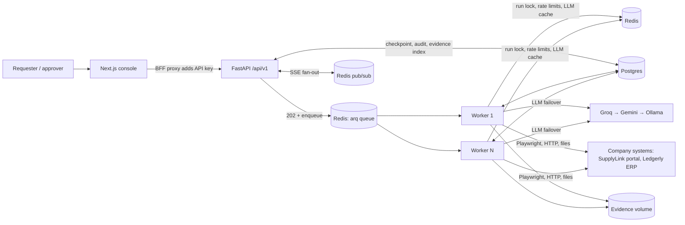
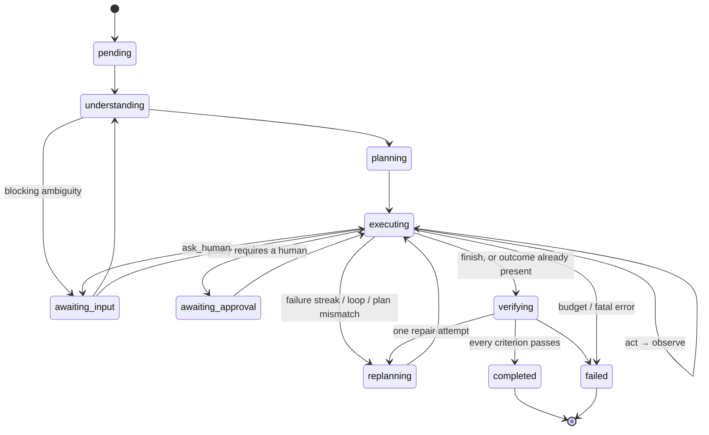

# Architecture

## System view

The API never runs agent work. It validates, authenticates, persists and enqueues; workers
execute. Scaling out means more workers: a Redis lock ensures a run has a single executor.

## The run loop

Every transition is checkpointed before the next side effect, and emitted as an event to the
append-only `run_events` table (the audit log) and to live subscribers.

## One step, in detail

1. **Decide** — the executing-stage prompt sees the goal, plan, success criteria, working memory
   (facts), the last few actions and the latest observation (untrusted, delimited). It returns
   one typed `NextAction` plus any facts it just learned.
2. **Assess** — the chosen tool describes what the action would do: risk (read / write /
   irreversible), target system and the *exact payload* (form fields of a submit, JSON body).
3. **Policy** — rules from `company_context/policies.yaml` run against that payload: allow,
   require approval (pause; resumes later under a single-use grant bound to the payload), or
   forbid (the agent is told and must adapt).
4. **Idempotency** — before any write, the verifier checks whether the success criteria already
   hold. If so, the write is skipped. This is what defeats lost acknowledgements and resumes.
5. **Execute** — through the tool registry with a timeout. Transient failures of *reads* retry
   with jittered backoff; writes are never blindly retried.
6. **Observe** — a typed `Observation` (settled page snapshot with element refs, document text,
   API response). The observer watches for failure streaks and loops and triggers re-planning.

## Components

| Package | Responsibility |
|---|---|
| `backend/app/agent/runtime` | State machine, orchestrator, budgets, ports (`RunRecorder`, `CompanyMemory`) |
| `backend/app/agent/stages.py` + `prompts/` | Four typed LLM calls: understand, plan, decide, report; versioned prompt files |
| `backend/app/agent/policy` | Approval / forbidden rules evaluated on concrete payloads |
| `backend/app/agent/verifier` | Independent post-condition checks against systems of record; value normalisation |
| `backend/app/agent/understanding` | Company context loader (systems, policies, procedures) and retrieval |
| `backend/app/tools` | Tool contract, registry, browser (Playwright), files, HTTP, control tools |
| `backend/app/llm` | OpenAI-compatible adapter, failover router, structured output with repair, cache |
| `backend/app/core` | Settings, logging with redaction, typed errors, rate limiter, retries, breakers |
| `backend/app/infrastructure` | Postgres models and repositories, Redis coordination, queue, evidence storage |
| `backend/app/services` | Use cases: submit task, read/stream/answer/cancel runs, resolve approvals, memory |
| `backend/app/workers` | arq worker: lock, load checkpoint, advance, defer on LLM outage |
| `frontend/` | Console: task input, live timeline, plan, approvals, questions, outcome, evidence |
| `sandbox/` | Mock company: SupplyLink portal (invoice PDFs) and Ledgerly ERP (UI + read API), chaos |
| `company_context/` | Everything company-specific the operator knows |

Dependencies point inward: `api → services → agent/domain ← infrastructure/tools/llm`. The
`domain` package has no framework or driver imports.

## Data model

`tasks` (request, idempotency key) → `runs` (status, JSONB checkpoint, summary) →
`steps` (action + observation per step), `run_events` (append-only, monotonic id for SSE
resume), `approvals` (payload, decision, edits), `evidence` (screenshots, files, reports) and
`memory_entries` (lessons and feedback, GIN full-text index). `api_keys` stores SHA-256 hashes.

## Where each system-design concern lives

| Concern | Implementation |
|---|---|
| Rate limiting | Redis token bucket (Lua, server time) per API key (429 + Retry-After), per LLM backend, per target host |
| Caching | LLM responses for deterministic calls; API-key lookups; company context reloads on file change |
| Queue / scale-out | arq on Redis; `POST /tasks` returns 202; N workers |
| Locking | `SET NX PX` run lock with owner-checked release |
| Idempotency | `Idempotency-Key` on task creation (Redis fast path, DB unique constraint); pre-write outcome check |
| Resilience | Retry with full jitter, per-action timeouts, circuit breakers per LLM backend and host, LLM failover, job deferral on outage |
| Audit / events | `run_events` as source of truth; SSE replays history then follows live without gaps |
| Security | Hashed API keys, server-side key handling in the BFF, CORS allowlist, host allowlist at the browser network layer, credentials injected by reference, log redaction, untrusted-content prompting |
| Observability | JSON logs with request and run correlation IDs, `/health/live`, `/health/ready`, `/metrics` |
